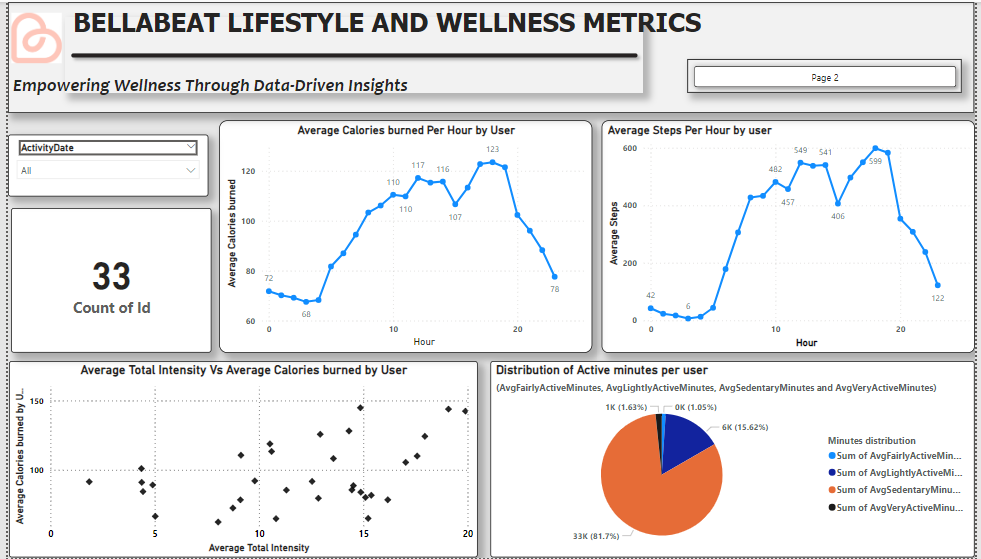

## ABOUT ME  

Hello! I’m **Okechukwu Nwaogwugwu**, a data analyst passionate about turning raw data into meaningful insights. With a strong background in **data visualization, analytics, and business intelligence**, I transform complex datasets into clear, impactful stories.  

## SKILLS

🔹 Work with **Excel (Power query, Power pivot), SQL, Power BI, Tableau, and Python** to analyze trends and optimize processes.  
🔹 Build **interactive dashboards** that bring data to life.  
🔹 Use data to solve complex problems and drive informed decisions across various domains.  

📈 Always learning, always exploring—let’s connect and talk data!  

---

## 📂 My Portfolio  
Here are some of the projects I’ve worked on.  

### 🔹 **Empowering Wellness Through Data-Driven Insights**  
📌 This analysis uncovers trends in smart device usage through Fitbit data, offering valuable insights to boost Bellabeat's market competitiveness and user satisfaction. The findings help shape Bellabeat’s marketing strategy, aligning it with evolving wellness trends.

🛠️ **Tools Used:** Microsoft SQL Server, Power BI 

  

🔗 **[Read More](https://medium.com/@okeyxiii/bellabeat-case-study-eea0d9e559c1)**  

 
