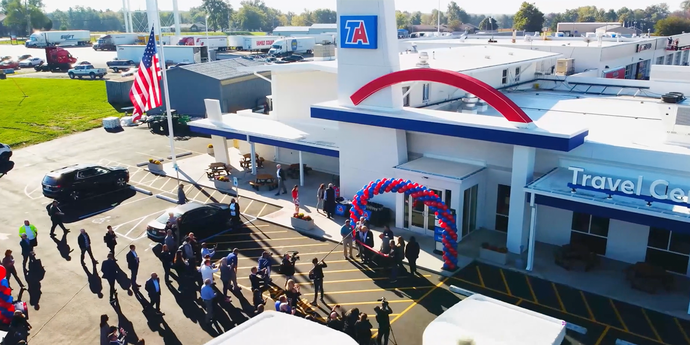

## ABOUT ME  

Hello! I’m **Okechukwu Nwaogwugwu**, a data analyst passionate about turning raw data into meaningful insights. With a strong background in **data visualization, analytics, and business intelligence**, I transform complex datasets into clear, impactful stories.  

## SKILLS

🔹 Work with **Excel (Power query, Power pivot), SQL, Power BI, Tableau, and Python** to clean, transform, analyze trends and optimize processes.  
🔹 Build **interactive dashboards** that bring data to life.  
🔹 Use data to solve complex problems and drive informed decisions across various domains.  

📈 Always learning, always exploring—let’s connect and talk data!  

---
## 📂 My Projects  
Here are some of the projects I’ve worked on.  

### 🔹 **Empowering Wellness Through Data-Driven Insights**  
📌 This analysis uncovers trends in smart device usage through Fitbit data, offering valuable insights to boost Bellabeat's market competitiveness and user satisfaction. The findings help shape Bellabeat’s marketing strategy, aligning it with evolving wellness trends.

🛠️ **Tools Used:** Microsoft SQL Server, Power BI 

  

🔗 **[Read More](https://medium.com/@okeyxiii/bellabeat-case-study-eea0d9e559c1)**  

---

### Store Offer Analysis: Data-Driven Recommendations  

### Project Overview  
In this analysis, I determined which food and beverage offers should be introduced in new store locations based on data-driven insights. The goal was to help senior leadership make informed decisions on product offerings by analyzing sales performance, customer behavior, and store types.  

🛠️ **Tools Used:** Excel (Power Query, Pivot Tables, Correlation Analysis), Data Visualization (Charts, Slicers, KPI Cards)  

## Report & Findings  
You can view the full analysis and recommendations here:  
[🔗 Read more](https://www.linkedin.com/pulse/data-driven-retail-expansion-how-i-determined-best-food-nwaogwugwu-oaqcf/?trackingId=mYcB%2FbIJpM3FIXcHzncuIQ%3D%3D)  

---

### 🔹 **Building an End-to-End Data Pipeline for an Online Bookstore**  
📌 In this article, I walk through the creation of an end-to-end data pipeline for a fictional bookstore, from generating simulated data with Python to building a comprehensive analytics solution using Snowflake, DBT, and Power BI.

🛠️ **Tools Used:** Python, AWS S3, Snowflake, DBT, Power BI 

🔗 **[Read More](https://www.linkedin.com/pulse/building-end-to-end-data-pipeline-online-bookstore-nwaogwugwu-ts8uf/?trackingId=IQRJ6WwKQ9KLb%2BwkCwEtog%3D%3D)**  

---

## 📬 Contact Me  
💼 [**LinkedIn**](https://www.linkedin.com/in/okechukwu-nwaogwugwu-016037145/)  
🐦 [**Twitter**](https://x.com/Okeykenneth1)  
✍️ [**Medium**](https://medium.com/@okeyxiii)  
📘 [**Facebook**](https://web.facebook.com/Okeyken/)  
📞 **Phone:** +234 7033527207(Whatsapp), +234 7016387992  

Let’s connect and collaborate! 🚀 
